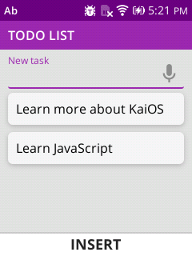
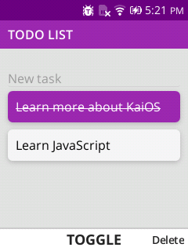
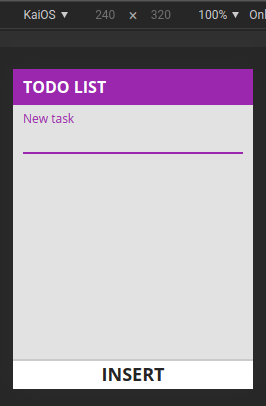
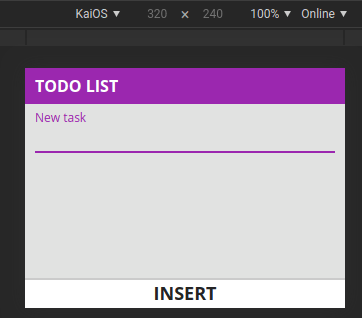

# Sample React app for KaiOS

Simple example of a to-do list, for more information see [KaiOS Developer Portal](https://developer.kaiostech.com/docs/02.getting-started/03.build-your-first-package-app/sample-code#react)




In portrait devices



In landscape devices



## Start

```console
npm run start
# or
yarn start
```

## Build app

```console
npm run build
# or
yarn build
```

## Send the app to a KaiOS device

follow [os-env-setup](https://developer.kaiostech.com/docs/02.getting-started/01.env-setup/os-env-setup) and [test-your-apps](https://developer.kaiostech.com/docs/02.getting-started/03.build-your-first-package-app/test-your-apps)
install to your device.
